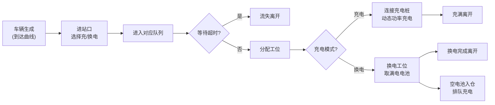
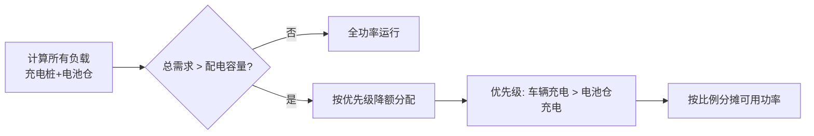

## 1. 产品概述
新能源物流车充换电站仿真决策系统，用于对比充电与换电模式的运营效率，辅助站点扩容和电价策略决策。通过Canvas动画直观展示车辆排队、充换电过程，内置复杂的电力分配和车辆行为仿真内核。

- 核心价值：在高成本建站前，通过仿真量化不同配置方案的运营指标，辅助投资决策
- 目标用户：充换电站运营方、规划设计人员、物流企业调度部门

## 2. 核心功能

### 2.1 功能模块
1. **站点仿真画布**：Canvas俯视图绘制进站口、充电桩、换电工位、电池仓、排队区，车辆以彩色方块动态展示
2. **仿真内核引擎**：车辆到达曲线、充电功率曲线、换电流程、电力容量约束与动态功率分配
3. **参数控制面板**：到达强度、设施数量、功率参数、配电容量、分时电价等可实时调节
4. **实时指标看板**：平均排队时长、最大队长、吞吐量、流失率、电池库存告急、电费成本、配电利用率
5. **趋势图表区**：滚动折线图实时展示队长、利用率、瞬时功率曲线
6. **时间控制**：暂停/播放、1x/5x/10x/30x多倍速加速
7. **扩容决策模块**：自动扫描多种扩容方案，运行多组仿真对比，输出性价比推荐

### 2.2 页面详情
| 页面名称 | 模块名称 | 功能描述 |
|-----------|-------------|---------------------|
| 主页面 | 顶部标题栏 | 系统标题、时间显示、播放控制按钮 |
| 主页面 | 左侧控制面板 | 参数分组滑杆：车流参数、设施配置、电力参数、电价策略 |
| 主页面 | 中央仿真画布 | Canvas动画展示站点俯视图和车辆动态 |
| 主页面 | 右上指标看板 | 8个核心指标卡片，实时数值+趋势指示 |
| 主页面 | 右下趋势图表 | 3个滚动折线图：队列长度、设施利用率、总功率 |
| 主页面 | 底部扩容决策 | 方案列表、对比表格、推荐结论 |

## 3. 核心流程

### 3.1 车辆生命周期

### 3.2 电力分配流程

## 4. 界面设计

### 4.1 设计风格
- **主色调**：深科技蓝(#1e3a5f) + 电力橙(#ff6b35) + 能源绿(#2ecc71) + 警示红(#e74c3c)
- **背景**：深色工业风，网格纹理，渐变叠加
- **字体**：显示字体采用 Space Mono（等宽科技感），正文采用 Inter
- **布局**：三栏布局，左侧控制面板(280px) + 中央画布(自适应) + 右侧指标区(320px)
- **按钮**：圆角8px，悬停微放大，激活状态发光
- **图标**：lucide-react 线性图标，科技简约风格

### 4.2 视觉元素
| 元素 | 配色 | 说明 |
|------|------|------|
| 充电桩 | #3498db | 蓝色，占用时变深 |
| 换电工位 | #9b59b6 | 紫色 |
| 电池仓 | #f39c12 | 橙色，电量条显示库存 |
| 车辆 | #2ecc71 | 绿色，低电量变红色 |
| 排队区 | #7f8c8d | 灰色网格 |
| 进站口 | #1abc9c | 青色 |

### 4.3 响应式
- 桌面优先设计，最小支持1440px宽度
- 画布自适应缩放，保持等比例
- 控制面板支持折叠收起

### 4.4 动画效果
- 车辆移动：平滑插值动画，60fps
- 充电/换电进度：环形进度条 + 脉冲效果
- 功率变化：数字跳动动画
- 新车辆入场：渐入 + 缩放
- 车辆离开：渐出效果
