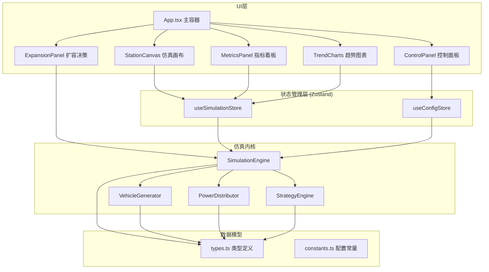
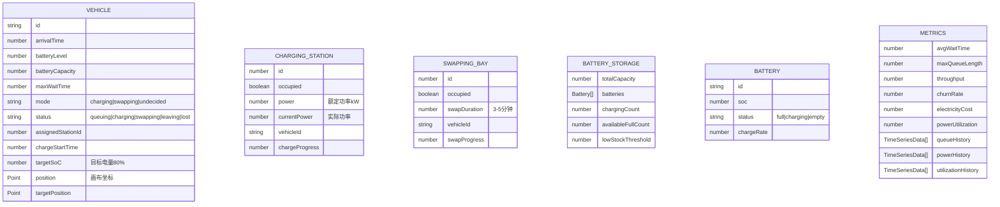

## 1. 架构设计



## 2. 技术描述

- **前端框架**：React@18 + TypeScript
- **构建工具**：Vite@5
- **样式方案**：TailwindCSS@3
- **状态管理**：Zustand
- **图形绘制**：原生 Canvas 2D API
- **图表库**：自定义 Canvas 折线图（避免额外依赖）
- **图标库**：lucide-react
- **后端**：纯前端，无后端依赖

## 3. 项目结构

```
src/
├── types/
│   └── index.ts          # 类型定义：Vehicle, Station, Battery, Metrics等
├── simulation/
│   ├── SimulationEngine.ts   # 仿真主引擎
│   ├── VehicleGenerator.ts   # 车辆生成器(到达曲线)
│   ├── PowerDistributor.ts   # 电力分配器(核心难点)
│   ├── StrategyEngine.ts     # 策略引擎(选充/换电、选工位)
│   └── constants.ts          # 仿真常量
├── store/
│   ├── useSimulationStore.ts # 仿真运行时状态
│   └── useConfigStore.ts     # 配置参数状态
├── components/
│   ├── ControlPanel/         # 左侧控制面板
│   ├── StationCanvas/        # 中央Canvas画布
│   ├── MetricsPanel/         # 右上指标看板
│   ├── TrendCharts/          # 右下趋势图表
│   └── ExpansionPanel/       # 底部扩容决策
├── hooks/
│   ├── useAnimationLoop.ts   # 动画循环Hook
│   └── useSimulation.ts      # 仿真逻辑Hook
├── utils/
│   ├── format.ts             # 格式化工具
│   └── math.ts               # 数学计算工具
├── App.tsx
├── main.tsx
└── index.css
```

## 4. 核心数据模型

### 4.1 实体类型定义



## 5. 仿真时间步长设计

- **物理时间**：1秒 = 仿真时间 1~30分钟（可调）
- **仿真步长**：100ms，每步更新所有实体状态
- **渲染帧率**：60fps，位置平滑插值
- **数据采样**：每5秒采样一次历史数据

## 6. 关键算法

### 6.1 充电功率曲线
```
P(soc) = P_max * (1 - 1/(1 + e^(-10*(soc-0.75))))
// soc < 75%: 满功率
// 75% < soc < 95%: 线性下降到30%
// soc > 95%: 涓流充电10%
```

### 6.2 电力分配算法
1. 计算优先级权重：车辆充电(1.0) > 电池仓充电(0.5)
2. 计算总需求功率 = Σ(车辆需求) + Σ(电池仓需求)
3. 若总需求 ≤ 配电容量：全功率运行
4. 否则：按优先级比例分配，车辆优先保证
5. 记录功率降额时段用于统计

### 6.3 车辆到站策略
1. 早晚高峰双峰分布：8:00-10:00，17:00-19:00
2. 到达间隔：泊松过程 + 高峰系数
3. 电量分布：均匀分布10%-50%
4. 模式选择：优先换电(若有电池)，否则充电
5. 工位选择：选择预计等待时间最短的

## 7. 扩容决策扫描

自动生成方案矩阵：
- 充电桩：+0, +2, +4, +6
- 换电工位：+0, +1, +2
- 电池仓容量：+0, +10, +20
- 配电容量：+0, 200kW, 500kW

对每个方案运行10次仿真（消除随机性），计算：
- 平均等待时间改善率
- 流失率改善率
- 投资成本估算
- 投资回收期（按节省的流失营收计算）
- 性价比得分 = 改善率 / 成本
